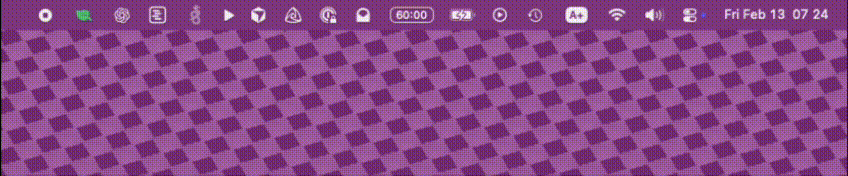
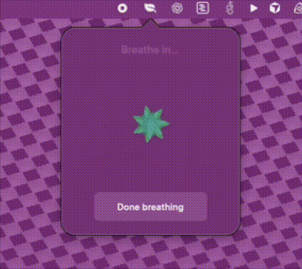

# BreatheBar

Remember to breathe. As you're coding, or doing other computer work with intense focus the entire day, you are tensing your body and pushing your mind for a very long time.

If you take a short break once an hour, and count breaths until that immediate stress leave your body, perhaps you won't be completely spent by the end of the day.

Every other app I found was too intrusive. BreatheBar is more subtle: it sits in your menu bar, and it will just start pulsing its icon when it's time to breathe, once an hour. You can then _choose_ to acknowledge it when you come out of your deepest focus, instead of being interrupted by a notification or window.

The breathing flower can guide you through deep inhales for as long as you need it. Try to count your breaths, up to 10 if you are very busy, 20 if you're feeling ambitious. If you lose the count because your mind wandered with stress or over-activeness, you have to start over from 1.

Once you're able to count breaths to your goal, your jaw has unclenched, your shoulders have dropped, and the swirling stress in your mind has calmed, at least a bit.

## About the app

[Download the latest release](https://github.com/nevyn/BreatheBar/releases/latest) to get started.

A mostly vibe coded app, by [Nevyn Bengtson](mailto:hello@nevyn.dev) and an unnamed Claude Code agent.

